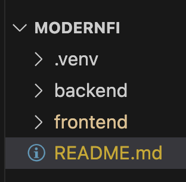
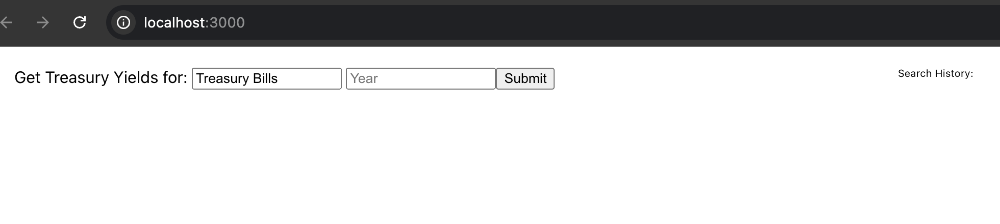
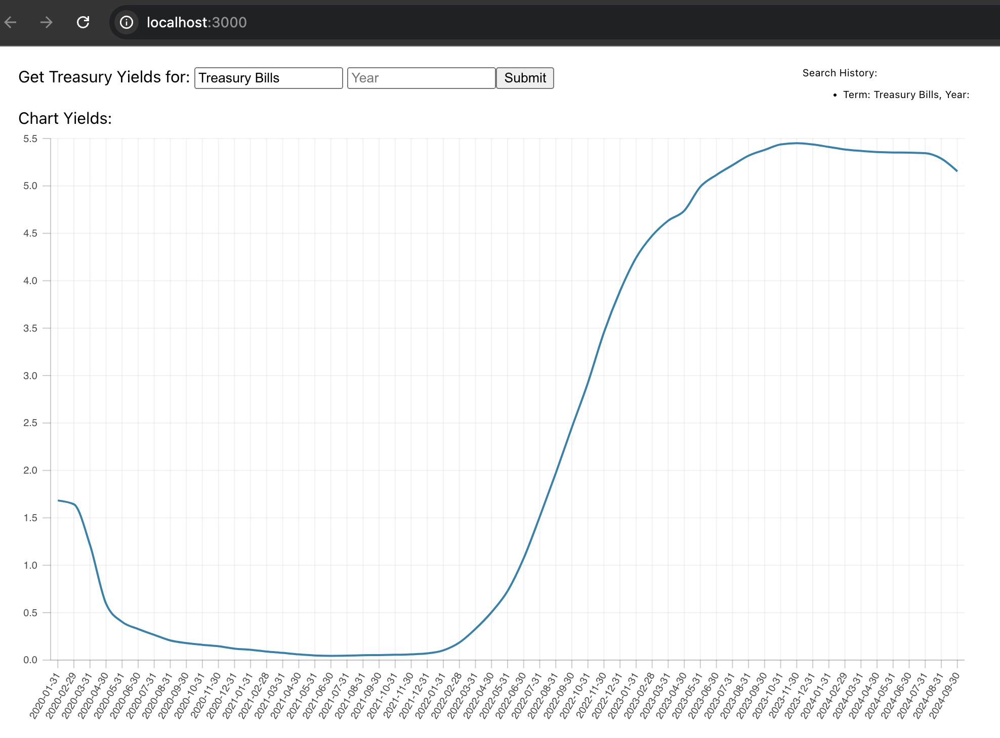

# ModernFI

## Get Treasury Info

### Install & Configure

#### Project structure



```sh
# clone repo
git clone ...

# create virtual environment
cd backend
python3 -m venv .venv

# activate it
source .venv/bin/activate # macOS/Linux
  OR
.venv\bin\activate # windows

# install project dependencies
pip install -R requirements.txt

# install frontend dependencies
cd ../frontend
npm install
```

### To Run

#### Backend server

```sh
cd backend
uvicorn main:app --reload
```

#### Frontend server

```sh
cd frontend
npm start
```

Navigate to: <http://localhost:3000/>

Should show this initial page:



Just click the [Submit] button to query with default parameters, which should show this:


